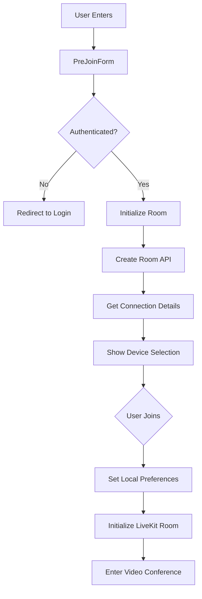
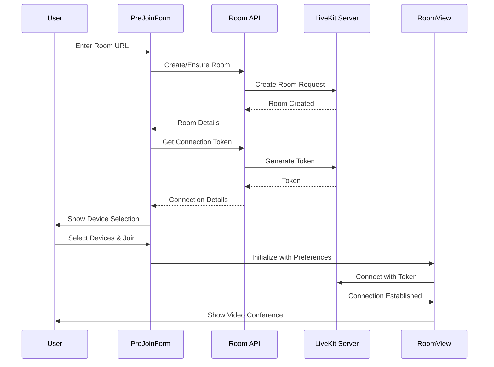

# Video Conferencing Implementation

This document details our robust video conferencing implementation using LiveKit, explaining the architecture, flow, and key design decisions.

## Architecture Overview

Our implementation follows a production-ready pattern that extends LiveKit's basic implementation with additional features for reliability, state management, and user experience.

### Key Components

1. **PreJoinForm (`components/pre-join/pre-join-form.tsx`)**
   - Handles room creation and initialization
   - Manages device selection and preview
   - Integrates with authentication
   - Handles connection setup

2. **RoomView (`components/room/room-view.tsx`)**
   - Manages active video conference
   - Handles participant interactions
   - Controls media tracks
   - Manages chat and UI state

3. **Room API (`app/api/rooms/create/route.ts`)**
   - Handles room creation
   - Manages LiveKit server interaction
   - Provides connection tokens
   - Ensures room existence before join

## Flow Diagram



## Sequence Diagram



## Why This Implementation is Robust

1. **Error Handling & Recovery**
   - Explicit room creation before join attempts
   - Connection error handling
   - Device selection fallbacks
   - Authentication state management

2. **State Management**
   - Centralized room state via `useRoom` hook
   - Persistent device preferences
   - Clean component unmounting
   - Proper React state patterns

3. **Security**
   - Authentication integration
   - Secure token generation
   - Server-side room creation
   - Protected API routes

4. **User Experience**
   - Device preview before joining
   - Seamless room transitions
   - Persistent preferences
   - Mobile responsiveness

5. **Maintainability**
   - Clear separation of concerns
   - Component reusability
   - Documented code structure
   - Type safety with TypeScript

## Implementation Details

### Room Creation and Initialization Flow

The implementation follows a robust state management pattern that handles initialization, caching, and error recovery:

```typescript
// 1. Component Initialization
PreJoinForm mounted with roomName
  → Checks session availability
  → Triggers room initialization if needed

// 2. Room Store State Management
initializeRoom(roomName, participantName)
  → Checks existing connection cache
  → Clears state for fresh initialization
  → Sets isInitializing flag

// 3. Room Creation
POST /api/rooms/create
  → Uses RoomServiceClient with server credentials
  → Creates/ensures room exists in LiveKit
  → Handles creation errors with details

// 4. Connection Setup
GET /api/connection-details
  → Generates participant token with proper grants
  → Returns validated connection details
  → Includes server URL and room information

// 5. State Updates
Room Store
  → Validates received connection details
  → Updates store with new state
  → Handles any errors with proper cleanup

// 6. UI Updates
PreJoin component
  → Shows loading states with progress
  → Displays device preview when ready
  → Handles user preferences
  → Shows error states with recovery options

// 7. Room Entry
LiveKitProvider
  → Uses validated connection details
  → Connects with proper token
  → Initializes media tracks
```

### State Management Details

The room store implements sophisticated state management:

```typescript
interface RoomState {
  isInitializing: boolean;    // Track initialization state
  error: string | null;       // Store error messages
  connectionDetails: {        // Connection information
    serverUrl: string;
    roomName: string;
    participantToken: string;
    participantName: string;
  } | null;
  // ... other state properties
}

// Key State Transitions:
1. Initial/Reset State
   → isInitializing: false
   → error: null
   → connectionDetails: null

2. During Initialization
   → isInitializing: true
   → error: null
   → connectionDetails: null

3. Success State
   → isInitializing: false
   → error: null
   → connectionDetails: { ... }

4. Error State
   → isInitializing: false
   → error: "detailed message"
   → connectionDetails: null
```

### Error Handling and Recovery

The implementation includes comprehensive error handling:

1. **API Error Handling**
   - Detailed error messages from both endpoints
   - Proper HTTP status codes
   - Error response formatting

2. **State Error Handling**
   - Connection detail validation
   - State cleanup on errors
   - Error message preservation

3. **UI Error Handling**
   - Toast notifications for immediate feedback
   - Error boundaries with retry options
   - Loading states with progress indication

4. **Recovery Mechanisms**
   - Automatic cache validation
   - State reset capabilities
   - Manual retry options

### Loading and Progress States

The UI implements a polished loading experience:

```typescript
if (isInitializing || !connectionDetails) {
  return (
    <Card className="w-full max-w-md mx-auto p-6 space-y-4">
      <div className="space-y-2 text-center">
        <h2 className="text-lg font-semibold">Setting Up Your Room</h2>
        <p className="text-sm text-muted-foreground">
          {isInitializing ? 'Initializing room...' : 'Waiting for connection details...'}
        </p>
      </div>
      <Progress value={isInitializing ? 40 : 80} className="w-full" />
    </Card>
  );
}
```

### Cache Management

The implementation includes smart caching:

1. **Cache Validation**
   - Checks existing connection details
   - Validates against current room and participant
   - Prevents unnecessary reinitializations

2. **Cache Invalidation**
   - Clears on initialization start
   - Resets on errors
   - Updates on successful connection

### Security Considerations

The implementation follows security best practices:

1. **Server-Side**
   - API key and secret only used server-side
   - Proper token generation with grants
   - Input validation and sanitization

2. **Client-Side**
   - Token-based authentication
   - Secure connection handling
   - Error message sanitization

### State Management

The implementation uses a custom `useRoom` hook that provides:
- Room connection state
- Local user preferences
- Device selections
- Connection details

This centralized state management ensures:
- Consistent room state across components
- Proper cleanup on unmount
- Reliable device tracking
- Seamless room transitions

## Best Practices Followed

1. **Component Architecture**
   - Clean separation between pre-join and room views
   - Reusable components
   - Proper prop typing
   - Event handling patterns

2. **API Design**
   - RESTful endpoints
   - Proper error responses
   - Authentication middleware
   - Rate limiting support

3. **State Management**
   - Custom hooks for shared state
   - React context where appropriate
   - Proper cleanup
   - Type-safe state

4. **Error Handling**
   - Graceful fallbacks
   - User-friendly error messages
   - Recovery mechanisms
   - Logging and monitoring

## Configuration Options

Key configuration options are managed through environment variables:
```env
LIVEKIT_API_KEY=your_api_key
LIVEKIT_API_SECRET=your_api_secret
LIVEKIT_URL=your_livekit_url
```

## Conclusion

This implementation provides a production-ready video conferencing solution that:
- Handles edge cases and errors gracefully
- Provides excellent user experience
- Maintains security best practices
- Follows React and TypeScript best practices
- Is easily maintainable and extensible

The architecture allows for future additions while maintaining a solid foundation for reliable video conferencing functionality.
